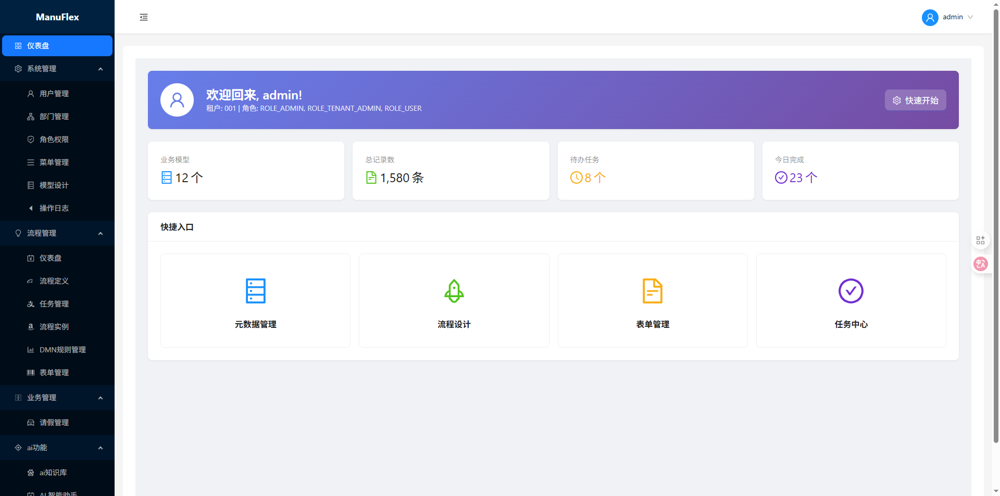
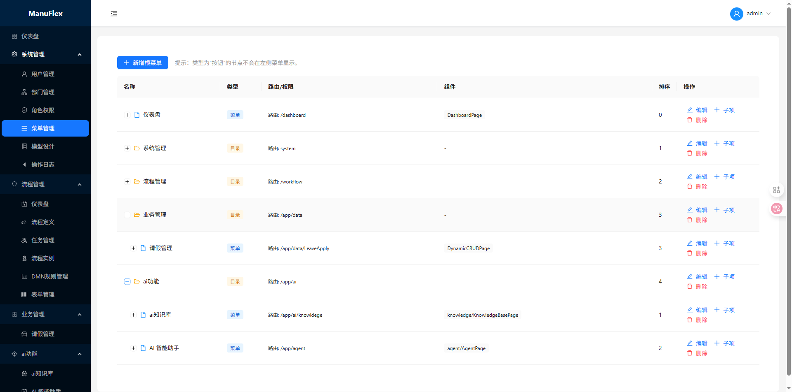
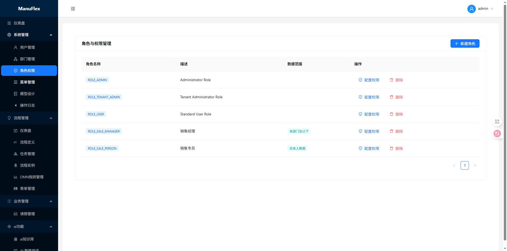
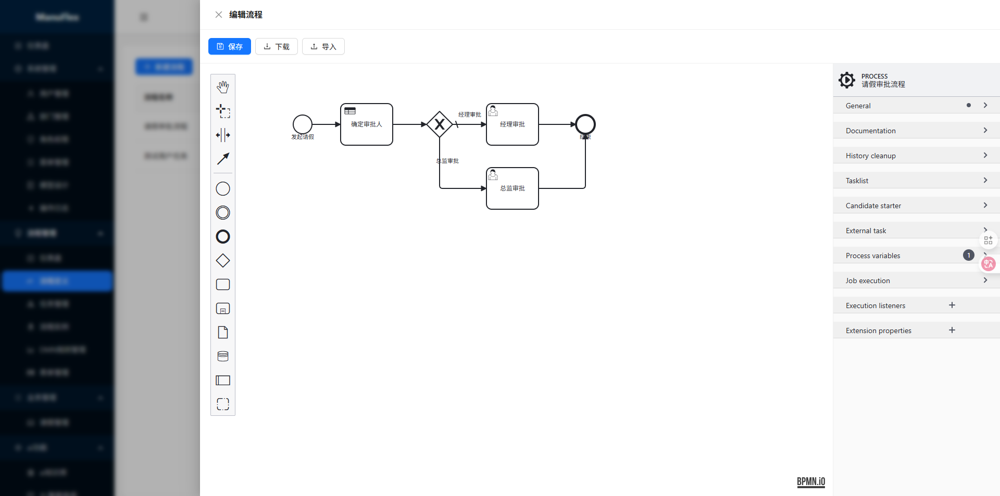
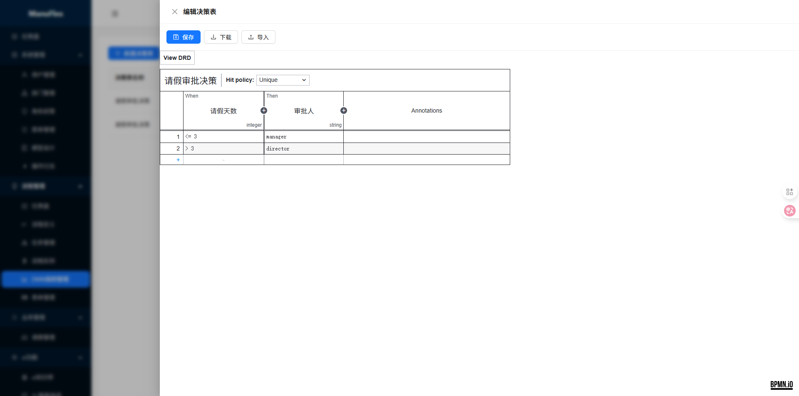
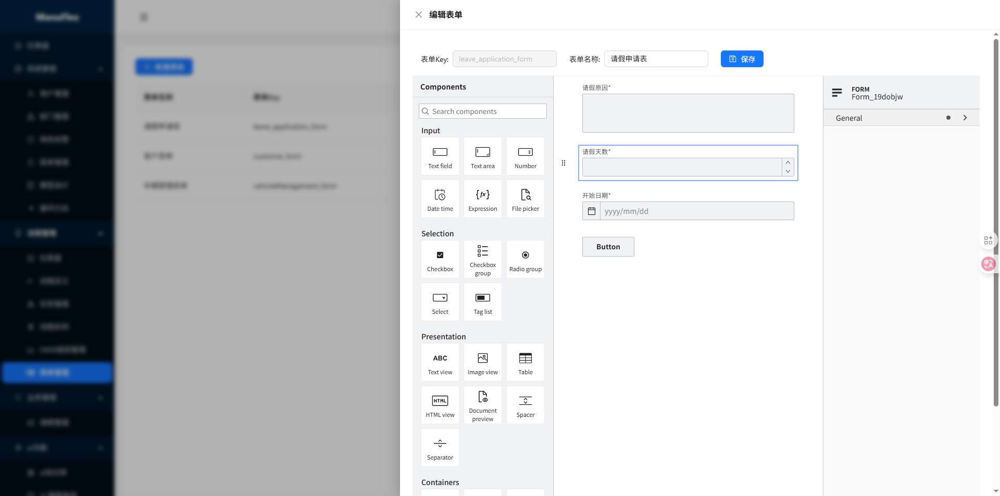
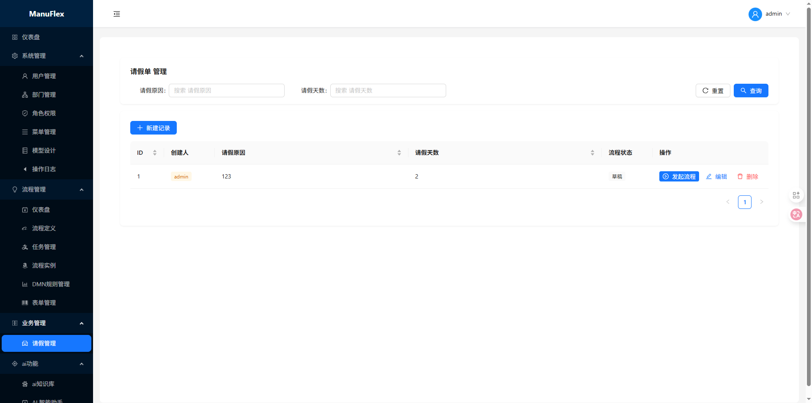
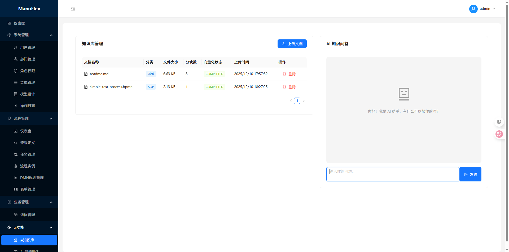
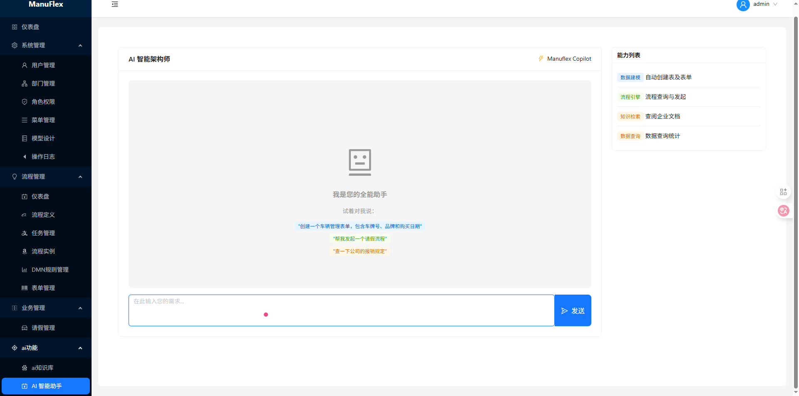

# Manuflex-React - 云原生无代码可视化引擎

Manuflex-React 是 Manuflex 平台的官方前端实现。它不仅是一个管理后台，更是一个强大的**可视化配置引擎**。通过高度模块化的设计，它能够将后端定义的元数据实时转化为功能完备的业务界面。

## 🌟 核心能力

* **可视化建模 (Visual Modeling)**:
    * **Schema Designer**: 拖拽式数据建模，定义业务实体及其关联关系。
    * **Workflow Engine**: 集成 bpmn-js，支持在线设计复杂的 BPMN 2.0 业务流程。
    * **DMN Rules**: 决策表设计器，实现业务逻辑的配置化决策（Decisions as Configuration）。
    * **Form Designer**: 基于 form-js 的拖拽式表单配置，实现数据收集的动态化。
* **智能交互 (AI-Native)**:
    * **Agent Workspace**: 深度集成 AI Agent 交互界面，支持通过自然语言进行 Schema 探索、数据分析与流程驱动。
* **动态渲染 (Dynamic Rendering)**:
    * **Dynamic CRUD**: 根据元数据自动生成列表、搜索、表单及校验逻辑，实现“配置即开发”。
* **行业适配器**: 预置 LIMS（实验室信息管理系统）相关组件，快速满足垂直行业定制需求。

## 🛠 技术栈

* **核心框架**: React 18 (Hooks), TypeScript 5.x
* **构建工具**: Vite (极致的开发体验与打包效率)
* **UI 组件库**: Ant Design (企业级 UI 规范)
* **可视化库**: 
    * `bpmn-js` (流程设计)
    * `dmn-js` (决策流设计)
    * `form-js` (表单渲染与设计)
* **状态管理与通信**: 
    * Context API (轻量级全局状态)
    * Axios (拦截器支持 JWT 鉴权与异常处理)
    * EventSource (支持 AI 流式响应与实时通知)

## 📂 目录结构规范

```text
src/
├── api/            # 封装微服务接口 (iam, metadata, workflow, agent, etc.)
├── components/     # 高复用原子组件及业务逻辑组件 (Renderer, Designer)
├── context/        # 全局上下文 (Auth, Theme)
├── pages/          # 路由页面 (按功能模块划分)
│   ├── agent/      # AI 助手交互
│   ├── workflow/   # 流程、任务、表单管理
│   ├── metadata/   # 元数据设计器
│   └── data/       # 动态数据展示
├── utils/          # 工具类 (SSE, 权限校验, 数据转换)
└── config/         # 动态组件映射表 (ComponentMap)
````


## 页面截图
### 1. 首页
[](./docs/images/1.首页.png)
### 2. 菜单
[](./docs/images/2.菜单.png)
### 3. 角色
[](./docs/images/3.角色.png)
### 4. 流程
[](./docs/images/4.流程.png)
### 5. 决策
[](./docs/images/5.决策.png)
### 6. 表单
[](./docs/images/6.表单.png)
### 7. 业务
[](./docs/images/7.业务.png)
### 8. ai知识库
[](./docs/images/8.ai知识库.png)
### 9. ai助手
[](./docs/images/9.ai助手.png)


## 🚀 开发指南

### 1. 安装依赖

```Bash
npm install
```

### 2. 配置环境变量

修改 `.env` 文件中的 `VITE_API_BASE_URL` 指向后端网关地址。

### 3. 启动开发服务器

```Bash
npm run dev
```

### 4. 生产构建

```Bash
npm run build
```